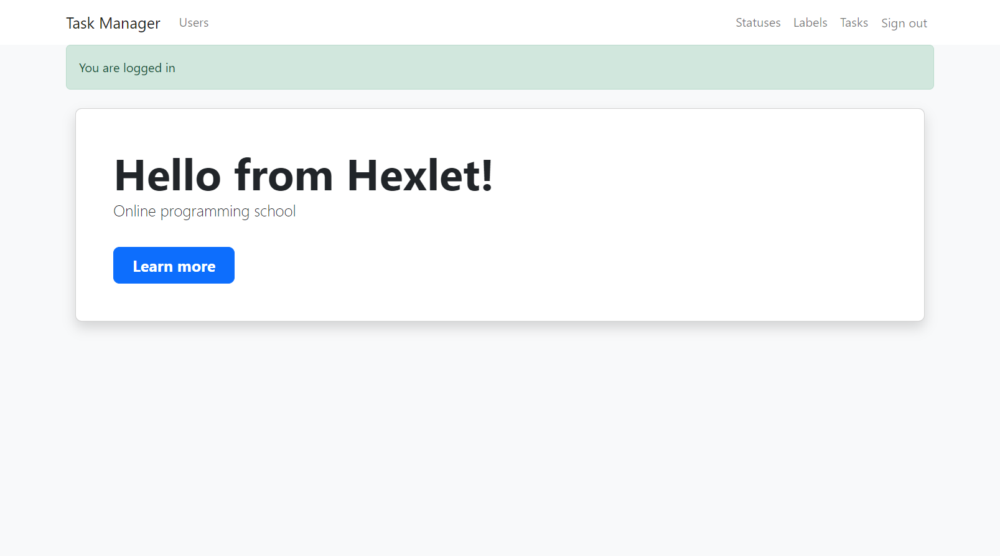
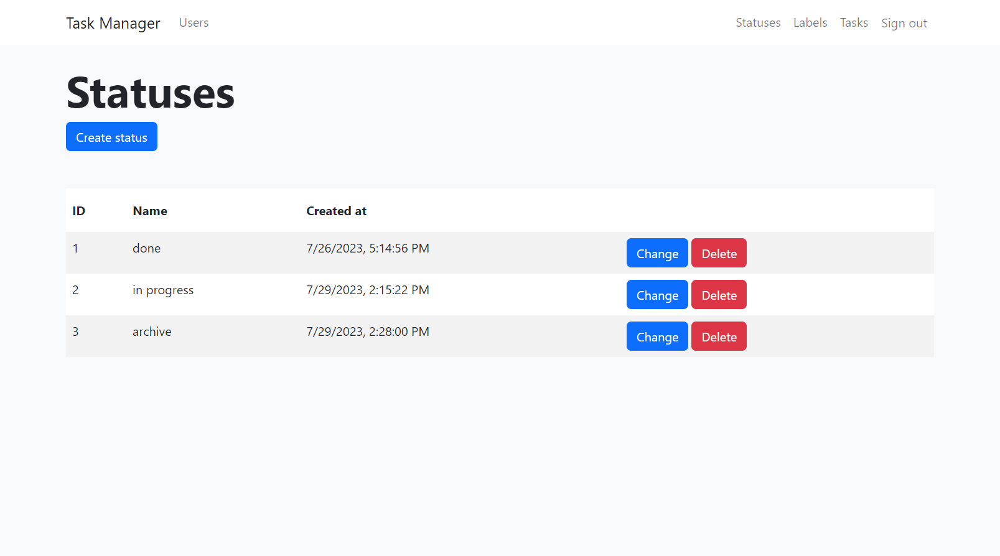
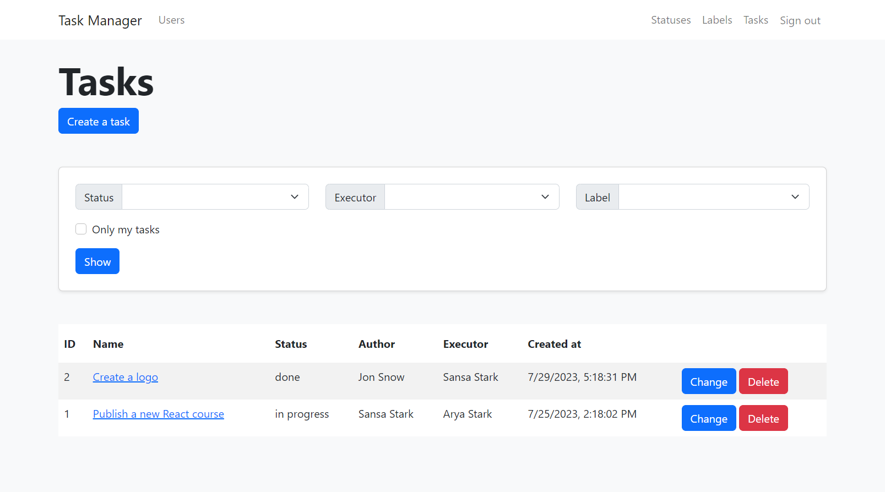

### Hexlet tests and linter status:
[](https://github.com/bushnastyaa/js-express-developer-project-6/actions)

## Description

Task Manager is a task management system like http://www.redmine.org/. Allows you to set and edit tasks, statuses and labels, as well as assign executors. Registration and authentication are required to work with the system.





## Installation

```bash
# Setup
make setup

# Run the app
make start
```

## Tools

* [Fastify](https://www.fastify.io)
* [Objection.js](https://vincit.github.io/objection.js)
* [Passport.js](https://www.passportjs.org)
* [Pug](https://pugjs.org/api/getting-started.html)
* [i18next](https://react.i18next.com)
* [Rollbar](https://docs.rollbar.com/docs/react)
* [Webpack](https://webpack.js.org)
* [Bootstrap](https://getbootstrap.com/)
